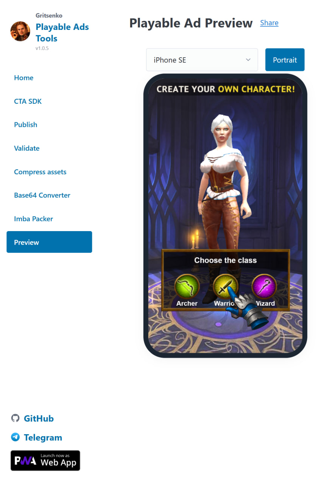
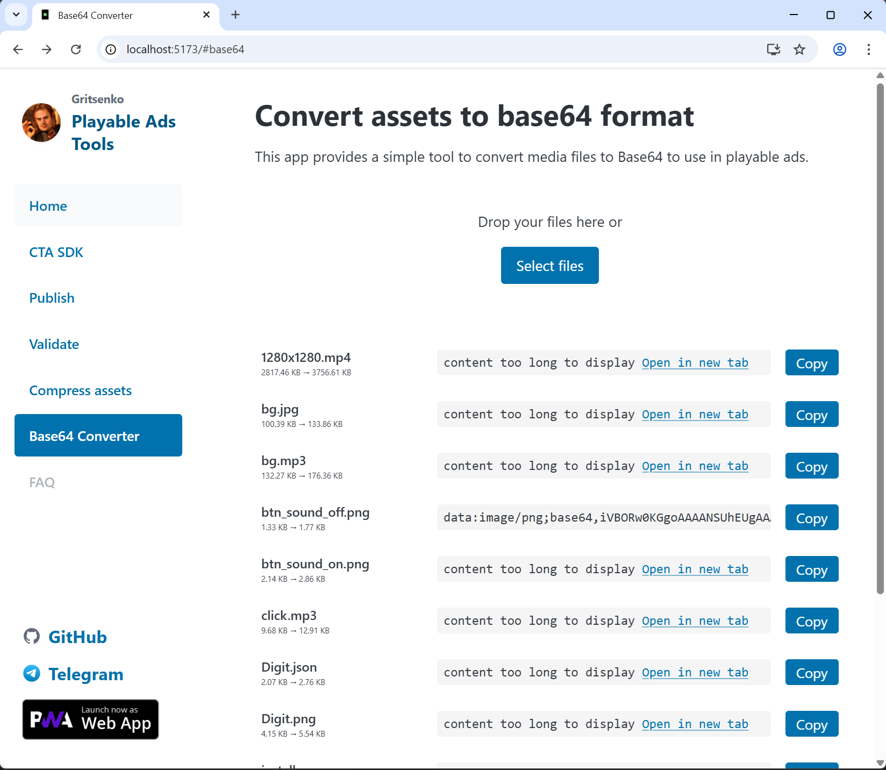

#  PlayableTools

<p align="center">
	
</p>

<p align="center">
	
</p>

<p align="center">
	<a href="https://tools.gritsenko.biz/"></a>
</p>

PlayableTools is a comprehensive web-based toolkit for preparing, publishing, and managing HTML5 playable ads across multiple advertising platforms. Built with modern web technologies and packaged as a Progressive Web App for seamless local development and offline use.

The app now uses clean URLs such as `/publish` and `/base64` instead of hash routes, and production builds prerender the main SEO landing pages so search engines can index meaningful HTML content.

## 🚀 Main Features

### 📤 **Multi-Platform Publishing**
- Publish HTML5 playable ads to 10+ major ad networks
- Automated platform-specific transformations and optimizations
- Support for both single HTML and ZIP package outputs
- Real-time progress tracking and detailed logging

### 🔄 **Base64 Converter**
- Convert any file type to Base64 encoding
- Drag-and-drop interface for easy file processing
- Optimized for embedding assets in HTML5 playables

### 🎬 **Video to Sprite Converter**
- Transform MP4 videos into PNG sprite sequences
- Perfect for game development and animations
- Configurable frame rates and output formats

### 📊 **Folder Size Visualizer**
- Interactive folder analysis and visualization
- Multiple view types: sunburst charts, treemaps, and tree views
- Built with D3.js for smooth, interactive experiences

### 🗜️ **HTML Compression (Imba Packer)**
- Advanced HTML compression using Pako library
- Maximizes file size reduction while preserving functionality
- Ideal for size-constrained advertising requirements

### 🖼️ **Asset Compression**
- PNG optimization and compression tools
- Integrates with PngChpocker for high-quality compression
- Reduces file sizes without quality loss

### 🎨 **Sprite Sheet Maker**
- Create optimized sprite sheets from individual images
- Supports multiple output formats and configurations
- Perfect for game development and animation workflows

### 📖 **CTA SDK Integration**
- Complete documentation for Call-to-Action SDK
- Integration guides and best practices
- Platform-specific implementation examples

### ✅ **Ad Network Validation**
- Technical requirement specifications for different platforms
- Automated validation tools for Facebook and other networks
- Stay compliant with latest platform requirements

### 📱 **Playable Preview**
- Multi-device testing and preview capabilities
- ZIP file support with virtual URLs for accurate testing
- GitHub integration for easy portfolio management

### 📂 **Portfolio Management**
- GitHub repository integration
- Organize and showcase your playable ad portfolio
- Quick preview and publishing from your existing projects

## 🛠️ Tech Stack

- **Build Tool**: Vite 7.x with TypeScript 5.8
- **Frontend Framework**: Lit 3.x web components
- **CSS Framework**: Pico CSS 2.x with custom theme
- **PWA**: Vite PWA plugin with service worker
- **Dependencies**: JSZip, Pako, Marked, D3.js
- **Routing**: Custom clean-URL router with route metadata support
- **SEO Build**: Static prerender step for public landing pages plus `sitemap.xml`, `robots.txt`, and `404.html` fallback generation

## 🌐 Supported Ad Platforms

- **Facebook** (Single HTML + ZIP variants)
- **Google** (ZIP with multi-size variants)
- **Moloco**
- **Mintegral**
- **IronSource**
- **AdColony**
- **Unity Ads**
- **AppLovin**
- **Vungle**
- **TikTok**

*Note: Each platform has specific requirements and optimizations built-in. Check the platform-specific options in the publish page for details.*

## 🚀 Quick Start

### 1. Install Dependencies

```powershell
npm install
```

### 2. Start Development Server

```powershell
npm run dev
```

### 3. Open Your Browser

Navigate to `http://localhost:5173/` (or the URL shown by Vite). The app supports PWA installation and will show update prompts when new versions are available.

### 4. Build for Production

```powershell
npm run build
```

Production build output includes:

- prerendered landing pages for `/`, `/publish`, `/cta-sdk`, `/validate`, `/base64`, and `/video2sprite`
- `dist/404.html` for GitHub Pages SPA fallback on non-prerendered routes
- `dist/sitemap.xml` and `dist/robots.txt` for search engine discovery

## 🔎 SEO & Deployment Notes

- Public landing pages use prerendered HTML with route-specific `title`, `description`, `canonical`, and `robots` metadata
- Internal routes such as `/preview`, `/portfolio`, `/projects`, and `/editor` stay functional but are marked `noindex`
- Legacy links like `/#/base64` are automatically migrated to clean URLs on page load
- GitHub Pages deep links work through the generated `404.html` fallback
- The prerender route source of truth lives in `src/seo/route-manifest.json`

## 📁 Project Structure

```
src/
├── fw/                    # Custom lightweight framework
├── Layout/               # Layout components (main layout, navigation)
├── pages/               # Page components
│   ├── publish/         # Publishing tools
│   ├── preview/         # Preview and testing tools
│   ├── portfolio/       # GitHub portfolio integration
│   ├── folder-size/     # Folder analysis visualizations
│   ├── spritesheet-maker/ # Sprite sheet creation
│   └── video2sprite/    # Video to sprite conversion
├── services/            # Business logic and services
├── utils/               # Utility functions
└── assets/              # Static assets and configurations
```

## 🧪 Test Files

Test your publishing workflow with included examples:

- `public/test-playable.html` — Complete playable example
- `public/test-simple-playable.html` — Minimal working example
- `test-facebook-validator.html` — Facebook-specific validation helper

## 🔄 ZIP Preview System

The preview system supports ZIP packages with complete asset extraction:

- Upload ZIP files containing HTML entry points and relative assets
- Assets are served via dedicated service worker at virtual URLs
- All relative path references work exactly as in the exported ZIP
- Perfect for testing multi-file playables with complex asset structures

## 📚 Developer Resources

- **Framework Documentation**: See `AGENTS.md` for detailed architecture and patterns
- **Service Worker**: Version checking and caching handled via `src/sw-version-handler.js`
- **Platform Adapters**: Add new platforms by following existing patterns in `src/services/PlayablePublishService.ts`
- **SEO Route Manifest**: Public/indexable route policy is defined in `src/seo/route-manifest.json`

## 🤝 Contributing

Contributions are welcome! Please:

1. Open an issue describing the proposed feature or bug fix
2. Include test cases or sample assets where applicable
3. Follow the existing code patterns and TypeScript conventions

## 📄 License

MIT License - see LICENSE file for details

<p align="center">
	<a href="https://tools.gritsenko.biz/"></a>
</p>
